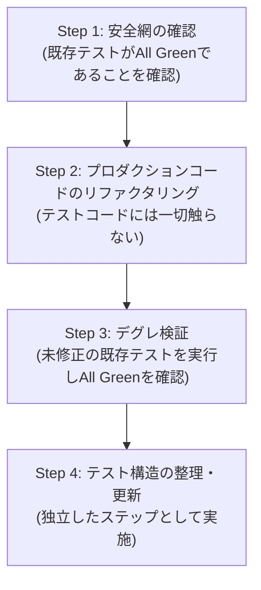

# 安全なリファクタリング原則ルール (Safe Refactoring Rule)

コードベースのリファクタリング（設計改善、責務分離、過剰コードの排除、パフォーマンス改善等）を行う際は、以下の原則を厳格に遵守すること。
特に、**「テストコードとプロダクションコードの同時変更の禁止」**と**「リファクタリング耐性のあるテスト設計」**を徹底する。

---

## 1. リファクタリングの厳格な定義 (Definition of Refactoring)

* **リファクタリングとは**:
  * **「外部から観測可能なシステムの振る舞い（入出力、UIとの契約、DB・メール等の外部副作用）を一切変更せずに、内部の設計・構造・可読性・保守性を改善する行為」** である。
* **仕様変更・アーキテクチャ刷新との明確な分離**:
  * 型定義の変更、インターフェースの変更、エラープロパティ名の変更などは「外部契約の変更（API Contract Change）」であり、狭義のリファクタリングではない。
  * 外部契約の変更を伴う場合は、内部リファクタリングと混同せず、計画段階から「インターフェース刷新」として切り出して順序立てて実行すること。

---

## 2. テストと実装の同時変更の厳禁 (No Simultaneous Changes)

* ❌ **絶対禁止: セルフテストの罠（False Positive / 偽陽性）**:
  * プロダクションコードのリファクタリングと、単体テストコードの変更を**同一コミット・同一タイミングで同時に行ってはならない**。
  * テストコードを同時に書き換えてしまうと、「変更が正しく振る舞いを維持しているからテストが通ったのか」それとも「壊れた実装に合わせてテストを改竄してしまったのか」を客観的に判断できなくなる。
* **テストの役割**:
  * テストは「リファクタリング中に振る舞いが壊れていないことを証明する不変の安全網（Safety Net）」でなければならない。

---

## 3. 4段階の安全リファクタリングプロセス (The 4-Step Refactoring Process)

リファクタリングを行う際は、必ず以下の4ステップを時系列順に踏むこと。

### Step 1: 安全網（テスト）の事前確認
* リファクタリングに着手する前に、対象機能のテストを実行し、全件パス（Green）することを確認する。
* もし振る舞いを担保するテストが存在しない、あるいは不十分な場合は、**リファクタリングコードを書く前に、まず振る舞いを固定するテストを追加・コミット**する（Pinning Test / Characterization Test）。

### Step 2: プロダクションコードのリファクタリング（テスト非接触）
* **テストコードには1行も手を加えず**、プロダクションコード（実装コード）のみをリファクタリングする。
* ロジックの共通化、関数の切り出し、不要な多重チェックの排除、KISS原則に沿った簡素化などを実施する。

### Step 3: デグレゼロの検証（All Green）
* Step 1 と全く同じ（1文字も変更していない）テストを実行する。
* 全テストが修正なしで一発でパス（Green）することを確認する。
* **この時点で初めて「外部から見た振る舞いを壊さずに内部改善が完了した」ことが客観的に証明される。**

### Step 4: テスト自体の構造整理・ピラミッド適正化（独立ステップ）
* レイヤー分離（ActionからServiceへのロジック抽出等）に伴い、テストの責務を再配置する場合（例: ActionテストからDBモックを外し、Service単体テストへ委譲する等）は、Step 3 の完了後に**独立した作業ステップ**として実施する。
* プロダクションコードのリファクタリングコミットと、テスト構造の更新コミットを分けること。

---

## 4. リファクタリング耐性のあるテスト設計 (Refactoring-Resistant Tests)

リファクタリング時にテストが頻繁に壊れる最大の原因は、**「テストが内部実装の詳細（ホワイトボックス）に過剰結合していること」**である。

* ❌ **過剰結合アンチパターン (White-box Mocking)**:
  * 「関数内で `prisma.user.findUnique` が呼ばれたか」「内部ヘルパー `calc()` が呼ばれたか」など、実装手順そのものをモックして検証するテスト。
  * 内部実装を改善しただけでテストが全滅し、テストの保守コストが跳ね上がる。
* ⭕ **振る舞い駆動・ブラックボックス検証 (Behavior-driven Verification)**:
  * テスト対象をブラックボックスとして扱い、**「与えた入力（パラメータ、FormData）」** に対して **「最終的な出力（戻り値型、ステータス）および副作用（DB永続化状態、送信メールデータ）」** を検証する。
  * 内部のアルゴリズムや関数の呼び出し順序を変えても、振る舞いが同じであればテストは一切壊れない。

---

## 5. 監査とスキル
リファクタリングを計画・実行・レビューする際は、必ず **`.agents/skills/safe-refactoring/SKILL.md`** のチェックリストに従って進めること。
