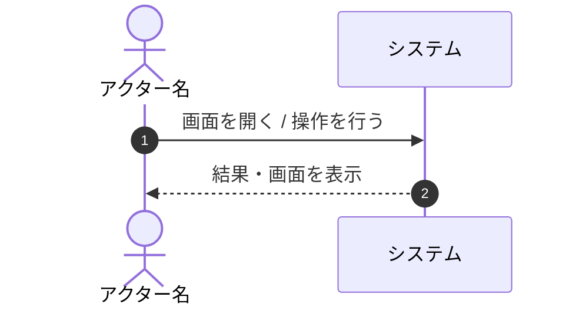

# ユースケースドキュメント作成・レビューガイドライン

システム機能のユースケースドキュメントを `doc/usecase/` 配下に作成・レビューする際は、以下の原則および記述フォーマットを厳格に遵守すること。

---

## 1. 基本原則 (Core Principles)

### ① ブラックボックス原則（内部設計の隠蔽）
* **ユーザー視点の振る舞いに限定する**: システムをブラックボックスとして扱い、外部のアクター（ユーザーや外部システム）から見て何が起きるかのみを記述する。
* **技術実装用語を排除する**:
  * ❌ 非推奨: 「トークン生成」「DBに保存」「ステータスをACTIVEに変更」「JWT発行」「バリデーションチェック」
  * ⭕ 推奨: 「専用の登録用リンクを発行」「アカウントを開設」「ログイン可能状態にする」「入力内容の確認」

### ② 1ユースケース = 1アクターの1目的（分割ルール）
* **非同期なフローや異なるアクターの操作は分割する**: 時間軸が異なる処理（例: 招待の送信と、招待の受諾・登録）は、1つのドキュメントにまとめず別のユースケースファイルに分割する。
* 例:
  * `doc/usecase/admin-invite-user.md`: 管理者がユーザーを招待する
  * `doc/usecase/user-register-via-invitation.md`: ユーザーが招待メールから登録する

---

## 2. ファイル命名・配置規則

* **配置先**: `doc/usecase/` 配下
* **ファイル名**: ケバブケース (`kebab-case`) で `[アクター名]-[アクションの説明].md` 形式とする。
  * 例: `admin-invite-user.md`, `user-register-via-invitation.md`

---

## 3. 標準セクション構造 (Standard Template)

ユースケースドキュメントは以下のセクション構成で作成する。

```markdown
# ユースケース: [アクター]が[目的/アクション]する

## 1. 概要 (Overview)
[誰が・何を行うプロセスの定義かを簡潔に1〜2文で記述]

## 2. アクター (Actors)
* **[アクター名]**: [アクターの役割・権限]

## 3. 事前条件 (Preconditions)
* [このユースケースを開始するために満たされているべき条件]

## 4. 事後条件 (Postconditions)
* [ユースケースが成功した結果、達成される状態]

## 5. 基本フロー (Main Success Scenario)



1. **[アクター]** [操作内容]
2. **[システム]** [確認・応答内容]

## 6. 代替・例外フロー (Alternative & Exception Flows)

### 6.1. [エラー・例外の条件]
* **6.1.1** [例外発生時のシステムの振る舞い・メッセージ]
* **6.1.2** [アクターの次の行動]

## 7. 関連画面
* **[対象アクター]**: [画面名] (`[パス例: /admin/users]`)
```

---

## 4. Mermaid シーケンス図のガイドライン

* **アクターとシステム境界の対話に絞る**: `System->>System`（システム内部の自己呼び出し）は最小限にとどめ、画面操作・入力・表示・通知に焦点を当てる。
* **表現の簡潔化**: メッセージ送信やリンククリックなど、外部から確認できるイベントのみを表現する。

---

## 5. レビュー時のセルフチェックリスト

- [ ] データモデル名（Prismaのテーブル名やカラム名）が含まれていないか？
- [ ] 「DBに保存」「トークンを生成」など実装手段に依存した記述になっていないか？
- [ ] 時間軸の異なる複数の処理が1つのユースケースに詰め込まれていないか？
- [ ] アクターの操作とシステムの応答が対応しているか？
