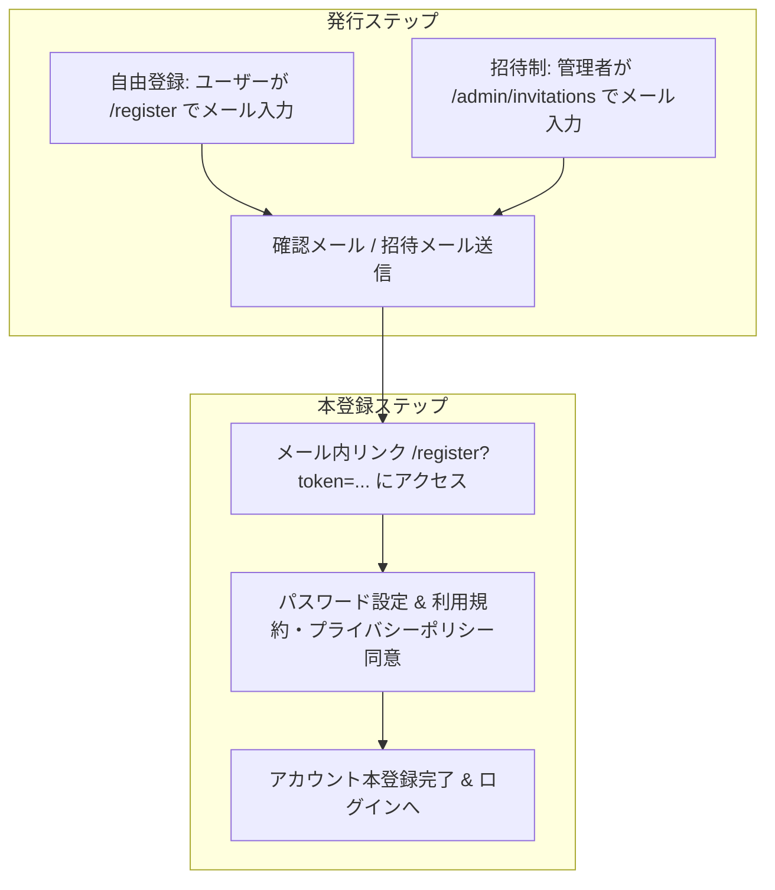

# Next Authの仕組みと認証・登録仕様

Next.js初学者向けにNext Authの仕組みと、本テンプレートにおける認証・会員登録の全体仕様を説明します。

---

## 1. 基本的な認証の流れ

```mermaid
graph TD
    UI[① 画面: (app)/login/page.tsx<br/>クライアント側] -->|フォーム送信/useActionState| SA[② Server Actions: actions/auth.ts<br/>サーバー側]
    SA -->|signInを呼び出し| NA[③ NextAuth設定: lib/auth.ts<br/>認証ロジック実行]
    NA -->|PrismaでDB検索| DB[(PostgreSQL)]
    NA -->|認証成功時| MW[④ ミドルウェア: middleware.ts<br/>& lib/auth.config.ts<br/>ルートアクセス制限]
```

---

## 2. ログインの2系統

本システムには、利用者のロールに応じて2つの独立したログイン系統が存在します。それぞれのユーザー情報はデータベース上でも別々のテーブル（`User` テーブルと `Admin` テーブル）に分かれて管理されています。

| 項目 | 一般ユーザー（User） | 管理者（Admin） |
| :--- | :--- | :--- |
| **用途** | 一般機能の利用、ダッシュボードの閲覧 | システム管理、運用操作 |
| **対象テーブル** | `User` テーブル | `Admin` テーブル |
| **ログイン画面 URL** | `/login` | `/admin/login` |
| **ログイン後の遷移先**| `/dashboard` | `/admin` |
| **ログイン時処理** | `authenticate` アクションの呼び出し | `authenticateAdmin` アクションの呼び出し（ロール情報 `admin` を付与してサインイン） |

---

## 3. ユーザー登録方式の設計と共通アーキテクチャ

本テンプレートでは、プロダクトの性質（オープン型BtoC・SaaS、またはクローズド型招待制SaaS）に合わせて、ユーザー登録方式を環境変数等で柔軟に切り替えられるハイブリッド設計を採用しています。

### 3.1. デフォルト設定と切り替えオプション
* **基本デフォルト**:
  * **自由登録制（Public Registration）**: **有効（ON）**
  * **招待制（Invitation System）**: **無効（OFF）**
* **設定環境変数（またはアプリ設定）**:
  * `ENABLE_PUBLIC_REGISTRATION=true` (デフォルト: `true`)
  * `ENABLE_INVITATION=false` (デフォルト: `false`)

### 3.2. 登録フローの共通化アーキテクチャ（メールアドレス所有確認型）
自由登録制・招待制ともに、**「確認メール送信 ➔ 専用ワンタイムリンクからパスワード設定＆規約同意」** というモダンかつセキュアな検証フローを採用しています。これにより、後半の「トークン検証・パスワード設定・規約同意」の画面およびサーバーロジックを完全共通化（DRY/KISS原則）しています。



| 登録方式 | エンドポイント | 説明 |
| :--- | :--- | :--- |
| **① 自由登録制** | `/register` | 一般ビジターがメールアドレスを入力し、届いた確認メールのリンクから本登録を行います。 |
| **② 招待制登録** | `/admin/invitations` | 管理者が招待メールを発行し、対象ユーザーが届いたリンクから本登録を行います。 |
| **③ 本登録画面** | `/register?token=...` | **（共通画面）** パスワード設定および利用規約・ポリシー同意を行ってアカウントを開設します。 |

※ 自由登録制がOFFの場合に `/register` にアクセスした際は、招待制の案内またはログイン画面へ安全にリダイレクトされます。

---

## 4. 管理者アカウントのセキュリティ運用

* **パスワード変更（通常時）**:
  * 管理者画面（`/admin`）にログイン後、専用のパスワード変更画面から安全に変更できます。
* **パスワード忘却時（リセット）の運用**:
  * 管理画面への不正侵入リスク（攻撃サーフェス）を最小限に抑えるため、画面からのパスワードリセットメール発行機能はあえて設けず、**サーバーCLI（`npx tsx scripts/create-admin.ts`）を用いた再設定・上書き運用**を基本方針とします。

---

## 5. 関連ファイル一覧

ログイン・認証・登録処理に関連する主要ファイルの一覧です。

### 5.1. 画面（UI）
* **一般ログイン**: [page.tsx](../../app/(public)/login/page.tsx)
* **一般新規登録（メール入力）**: [page.tsx](../../app/(public)/register/page.tsx)
* **一般本登録（パスワード・規約同意）**: [page.tsx](../../app/(public)/register/page.tsx)（`token` クエリパラメータによる動的表示切り替え）
* **退会完了画面**: [page.tsx](../../app/(public)/deactivated/page.tsx)
* **管理者ログイン**: [page.tsx](../../app/(admin)/admin/login/page.tsx)
* **管理者招待管理**: [page.tsx](../../app/(admin)/admin/invitations/page.tsx)

### 5.2. サーバーアクション（Server Actions）
* **一般ユーザー認証・登録**: [auth.ts](../../app/actions/auth.ts)
  * `authenticate`: 一般ログイン
  * `requestRegistrationEmailAction`: 自由登録の確認メール送信
  * `registerUserAction`: 本登録（パスワード設定・規約同意、招待制と共通）
  * `userSignOut`: 一般ログアウト（トップ `/` へリダイレクト）
* **管理者認証**: [adminAuth.ts](../../app/actions/adminAuth.ts)
  * `authenticateAdmin`: 管理者ログイン（NextAuthに `{ role: 'admin' }` を付与）
  * `changeAdminPassword`: 管理者パスワード変更
  * `adminSignOut`: 管理者ログアウト
* **管理者招待アクション**: [invitation.ts](../../app/actions/invitation.ts)
  * `inviteUser`: 管理者からのユーザー招待メール送信
  * `resendInvitation`: 招待再送信
  * `cancelInvitation`: 招待取り消し

### 5.3. NextAuth 設定・認証ロジック
* **認証プロバイダー設定**: [auth.ts](../../lib/auth.ts)
  * Credentialsプロバイダーを定義し、渡されたロール（`admin` か否か）に応じて検索対象テーブル（`prisma.admin` または `prisma.user`）を自動切り替え。
* **セッション・ルート保護設定**: [auth.config.ts](../../lib/auth.config.ts)
  * 未ログイン時のリダイレクト先や、ページアクセス制限（`authorized` コールバック）を定義。

### 5.4. ミドルウェア
* **アクセス制御**: [middleware.ts](../../middleware.ts)
  * NextAuthの設定を利用し、静的ファイルやAPIを除く全ルートでリクエストをチェックしてアクセスを制御。
