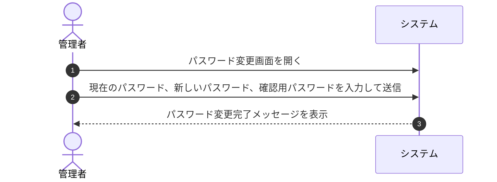

# ユースケース: 管理者がパスワードを変更する

## 1. 概要 (Overview)
システム管理者が管理者専用画面から自身のログインパスワードを安全に変更するプロセスを定義します。

## 2. アクター (Actors)
* **管理者 (Admin)**: 管理者権限でログイン中の運用アクター。

## 3. 事前条件 (Preconditions)
* 管理者が管理者アカウントで管理者画面（`/admin`）にログインしていること。
* 現在の管理者パスワードを把握していること。

## 4. 事後条件 (Postconditions)
* 管理者のログインパスワードが新しいパスワードに更新される。
* 次回以降の管理者ログイン時に新パスワードで認証が行われる。

## 5. 基本フロー (Main Success Scenario)

1. **[管理者]** 管理者画面のサイドバーメニューから「パスワード変更」画面を開きます。
2. **[管理者]** 「現在のパスワード」「新しいパスワード」「新しいパスワード（確認用）」を入力し、「パスワードを変更」ボタンを押します。
3. **[システム]** 入力された「現在のパスワード」が登録内容と一致することを確認します。
4. **[システム]** 「新しいパスワード」が要件（8文字以上）を満たし、「確認用」と一致することを確認します。
5. **[システム]** パスワードを更新し、「パスワードを変更しました」と完了メッセージを表示します。

## 6. 代替・例外フロー (Alternative & Exception Flows)

### 6.1. 現在のパスワードが間違っている場合
* **6.1.1** 「現在のパスワード」が一致しない場合、システムは「現在のパスワードが正しくありません」とエラーメッセージを表示し、更新を中断します。
* **6.1.2** 管理者は正しい現在のパスワードを入力し直します。

### 6.2. 新しいパスワードが要件を満たさない場合（8文字未満など）
* **6.2.1** 新しいパスワードが8文字未満の場合、システムは「パスワードは8文字以上で入力してください」とエラーメッセージを表示します。
* **6.2.2** 管理者は8文字以上のパスワードを入力し直します。

### 6.3. 新しいパスワードと確認用が一致しない場合
* **6.3.1** 新しいパスワードと確認用の入力内容が一致しない場合、システムは「新しいパスワードが確認用と一致しません」とエラーメッセージを表示します。
* **6.3.2** 管理者は確認用パスワードを正しく入力し直します。

## 7. 関連画面
* **管理者用**: 管理者パスワード変更画面 (`/admin/settings` または `/admin/change-password`)

## 8. 仕様・セキュリティ上の考慮事項
* **パスワード自動補完・生成への対応**:
  * ブラウザやパスワードマネージャーの強力なパスワード自動生成機能を妨げないよう、適切なフォーム属性（`autocomplete="current-password"` / `autocomplete="new-password"`）を設定し、確認用入力欄への同時補完をサポートする。
* **パスワード忘却時（リセット）の運用**:
  * 管理者アカウントのパスワード忘却時は、外部からの不正アクセスリスクを排除するため、画面からのリセット機能は提供せず、サーバーCLI（`npx tsx scripts/create-admin.ts`）等で直接上書き・再設定する運用とします。
