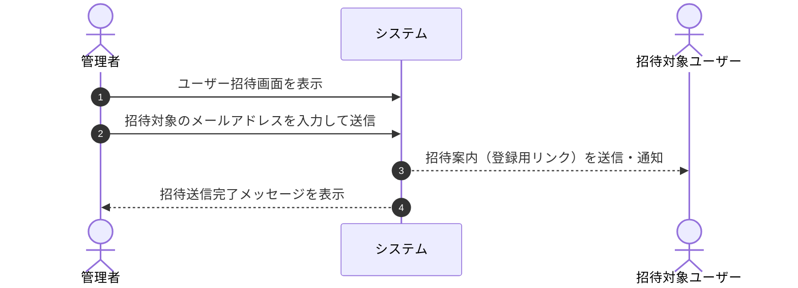

# ユースケース: 管理者がユーザーを招待する

## 1. 概要 (Overview)
管理者がシステム（管理者ダッシュボード）から新しい一般ユーザーのメールアドレスを指定し、招待案内（専用の登録用リンク）を発行・通知するプロセスを定義します。

## 2. アクター (Actors)
* **管理者 (Admin)**: ユーザーの管理および招待操作を行う権限を持つアクター。

## 3. 事前条件 (Preconditions)
* 管理者が管理者アカウントでシステム（管理者ダッシュボード）にログインしていること。
* システムの「招待機能」が有効（ON）に設定されていること。

## 4. 事後条件 (Postconditions)
* 招待対象の一般ユーザー宛に招待案内（専用の登録用リンク）が通知される。
* 管理者画面上で招待送信完了メッセージが表示され、招待中一覧に反映される。

## 5. 基本フロー (Main Success Scenario)

1. **[管理者]** 管理者ダッシュボードのユーザー管理メニューから「ユーザー招待」画面を開きます。
2. **[管理者]** 招待したい一般ユーザーのメールアドレスを入力し、「招待を送信」ボタンを押します。
3. **[システム]** 入力されたメールアドレスが未登録であることを確認します。
4. **[システム]** 招待対象のユーザー宛に招待案内（登録用リンク）を送信・通知します。
5. **[システム]** 管理者画面に「招待を送信しました」と完了メッセージを表示します。

## 6. 代替・例外フロー (Alternative & Exception Flows)

### 6.1. 招待機能自体が無効（OFF）に設定されている場合
* **6.1.1** システムの「招待機能」が無効に設定されている場合、システムは招待メニューを非表示とするか、招待画面上に「招待機能は現在無効化されています」と明示して送信フォームを無効化します。

### 6.2. メールアドレスが既に登録済みの場合
* **6.2.1** 入力されたメールアドレスが既存ユーザーまたは招待中のアドレスと重複している場合、システムは「指定されたメールアドレスは既に登録されています」とエラーメッセージを表示し、処理を中断します。
* **6.2.2** 管理者は正しいメールアドレスを入力し直すか、操作をキャンセルします。

### 6.3. 招待の取り消し・再送
* **6.3.1** 管理者は招待中の一覧画面から、対象ユーザーへの招待案内の再送信、または招待の取り消し（発行済みリンクの無効化）を行うことができます。

## 7. 関連画面
* **管理者用**: ユーザー管理・招待画面 (`/admin/invitations`)
