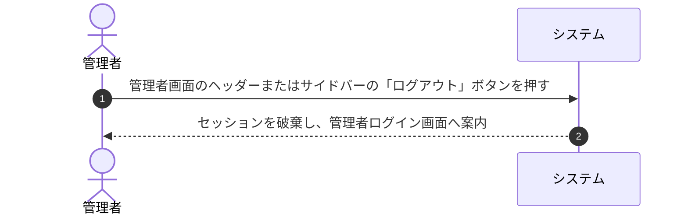

# ユースケース: 管理者がログアウトする

## 1. 概要 (Overview)
システム管理者が管理者ダッシュボードから管理者セッションを終了（ログアウト）し、未ログイン状態に戻るプロセスを定義します。

## 2. アクター (Actors)
* **管理者 (Admin)**: 管理者権限でログイン中の運用アクター。

## 3. 事前条件 (Preconditions)
* 管理者が管理者アカウントで管理者画面（`/admin`）にログインしていること。

## 4. 事後条件 (Postconditions)
* 管理者セッションが破棄され、管理者専用画面へのアクセス権限が解除される。
* 管理者ログイン画面に遷移する。

## 5. 基本フロー (Main Success Scenario)

1. **[管理者]** 管理者画面（ヘッダーまたはサイドバーメニュー）の「ログアウト」ボタンを押します。
2. **[システム]** 管理者セッションを破棄し、管理者ログイン画面（`/admin/login`）へ遷移します。

## 6. 代替・例外フロー (Alternative & Exception Flows)

### 6.1. 既にセッションが切れていた場合
* **6.1.1** セッション有効期限切れ等の場合でも、システムは安全に未ログイン状態として管理者ログイン画面へ案内します。

## 7. 関連画面
* **管理者用**: 管理者画面全般 (`/admin/*`)、管理者ログイン画面 (`/admin/login`)
