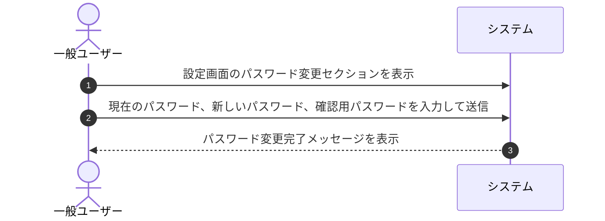

# ユースケース: ユーザーがパスワードを変更する

## 1. 概要 (Overview)
一般ユーザーが設定画面から自身のログインパスワードを安全に変更するプロセスを定義します。

## 2. アクター (Actors)
* **一般ユーザー (User)**: 自身のアカウントのセキュリティ情報を管理するログイン中のアクター。

## 3. 事前条件 (Preconditions)
* 一般ユーザーが自身のアカウントでシステムにログインしていること。
* 現在のパスワードを把握していること。

## 4. 事後条件 (Postconditions)
* ユーザーのログインパスワードが新しいパスワードに更新される。
* 次回以降のログイン時に新パスワードで認証が行われる。

## 5. 基本フロー (Main Success Scenario)

1. **[一般ユーザー]** 画面上部ヘッダーまたはダッシュボードから「設定」画面を開き、「パスワード変更」セクションへ進みます。
2. **[一般ユーザー]** 「現在のパスワード」「新しいパスワード」「新しいパスワード（確認用）」を入力し、「パスワードを変更」ボタンを押します。
3. **[システム]** 入力された「現在のパスワード」が登録内容と一致することを確認します。
4. **[システム]** 「新しいパスワード」が要件（8文字以上）を満たし、「確認用」と一致することを確認します。
5. **[システム]** パスワードを更新し、「パスワードを変更しました」と完了メッセージを表示します。

## 6. 代替・例外フロー (Alternative & Exception Flows)

### 6.1. 現在のパスワードが間違っている場合
* **6.1.1** 「現在のパスワード」が一致しない場合、システムは「現在のパスワードが正しくありません」とエラーメッセージを表示し、更新を中断します。
* **6.1.2** 一般ユーザーは正しい現在のパスワードを入力し直します。

### 6.2. 新しいパスワードが要件を満たさない場合（8文字未満など）
* **6.2.1** 新しいパスワードが8文字未満の場合、システムは「パスワードは8文字以上で入力してください」とエラーメッセージを表示します。
* **6.2.2** 一般ユーザーは8文字以上のパスワードを入力し直します。

### 6.3. 新しいパスワードと確認用が一致しない場合
* **6.3.1** 新しいパスワードと確認用の入力内容が一致しない場合、システムは「新しいパスワードが確認用と一致しません」とエラーメッセージを表示します。
* **6.3.2** 一般ユーザーは確認用パスワードを正しく入力し直します。

## 7. 関連画面
* **一般ユーザー用**: 設定画面 (`/settings`)

## 8. UI/UX・フォーム仕様の考慮事項
* **パスワード自動補完・生成への対応**:
  * ブラウザやパスワードマネージャー（Safari, Chrome等）の強力なパスワード自動生成機能を妨げないよう、適切なフォーム属性（`autocomplete="current-password"` / `autocomplete="new-password"`）を設定し、確認用入力欄への同時補完をサポートする。
