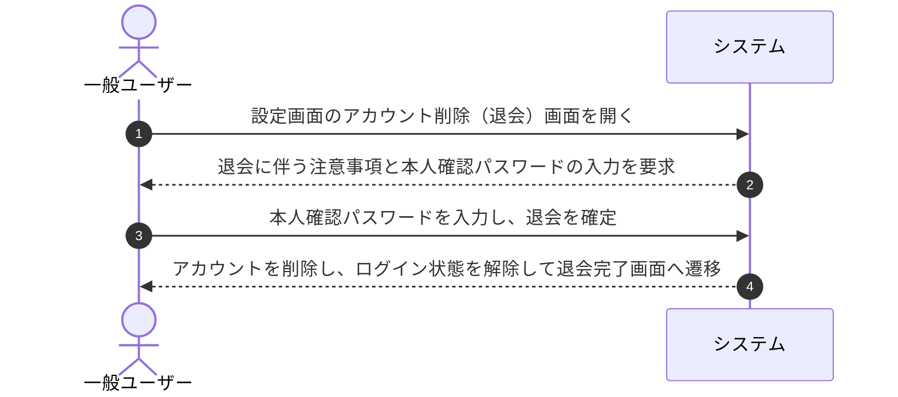

# ユースケース: ユーザーが退会（アカウント削除）する

## 1. 概要 (Overview)
一般ユーザーが設定画面から自身のアカウントを削除（退会）し、登録データおよびログインセッションを完全に消去した上で、専用の退会完了画面へ遷移するプロセスを定義します。

## 2. アクター (Actors)
* **一般ユーザー (User)**: システムの利用終了を希望するログイン中のアクター。

## 3. 事前条件 (Preconditions)
* 一般ユーザーが自身のアカウントでシステムにログインしていること。
* 現在のログインパスワードを把握していること。

## 4. 事後条件 (Postconditions)
* ユーザーのアカウント情報および関連データがシステムから完全に削除される。
* ユーザーのログインセッションが破棄され、退会完了画面（`/goodbye`）へ遷移する。

## 5. 基本フロー (Main Success Scenario)

1. **[一般ユーザー]** 設定画面から「アカウント削除（退会）」の操作を開始します。
2. **[システム]** 退会によりアカウント情報が完全に消去される旨の注意事項を表示し、本人確認のための「現在のパスワード」の入力を求めます。
3. **[一般ユーザー]** 本人確認のためのパスワードを入力し、「退会する」ボタンを押します。
4. **[システム]** 入力されたパスワードが登録内容と一致することを確認します。
5. **[システム]** ユーザーアカウントをシステムから完全に削除し、ログイン状態を解除（ログアウト）した上で、専用の退会完了画面（`/goodbye`）へ案内します。

## 6. 代替・例外フロー (Alternative & Exception Flows)

### 6.1. ユーザーが操作をキャンセルした場合
* **6.1.1** ユーザーが削除の確定を行わずにキャンセルした場合、システムは削除を実行せず設定画面に戻ります。

### 6.2. 本人確認用パスワードが一致しない場合
* **6.2.1** 入力されたパスワードが間違っている場合、システムは「パスワードが正しくありません」とエラーメッセージを表示し、削除処理を中断します。
* **6.2.2** 一般ユーザーは正しいパスワードを入力し直します。

## 7. 関連画面
* **一般ユーザー用**: 設定画面 (`/settings`)、退会完了画面 (`/goodbye`)
