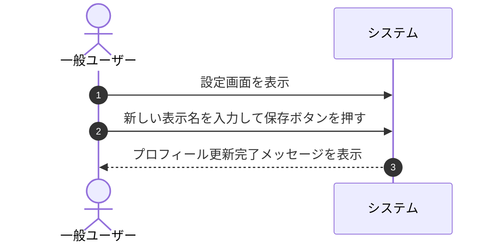

# ユースケース: ユーザーがプロフィールを編集する

## 1. 概要 (Overview)
一般ユーザーが設定画面から自身のプロフィール情報（ダッシュボード等に表示される「表示名」）を登録・変更するプロセスを定義します。

## 2. アクター (Actors)
* **一般ユーザー (User)**: システムを利用するログイン中の一般アクター。

## 3. 事前条件 (Preconditions)
* 一般ユーザーが自身のアカウントでシステムにログインしていること。

## 4. 事後条件 (Postconditions)
* ユーザーのプロフィール（表示名）が更新される。
* ダッシュボードや設定画面上で新しい表示名が表示される。

## 5. 基本フロー (Main Success Scenario)

1. **[一般ユーザー]** 画面上部ヘッダーまたはダッシュボードから「設定」画面を開きます。
2. **[システム]** 現在のユーザー情報（登録メールアドレスおよび設定済みの表示名）を表示します。
3. **[一般ユーザー]** 「表示名」入力欄に新しい表示名を入力し、「変更を保存」ボタンを押します。
4. **[システム]** 入力内容（文字数が50文字以内であること等）を確認します。
   * ※ 表示名は他のユーザーと重複していても設定可能です。
5. **[システム]** プロフィール情報を更新し、「プロフィールを更新しました」と完了メッセージを表示します。

## 6. 代替・例外フロー (Alternative & Exception Flows)

### 6.1. 表示名の文字数が上限（50文字）を超えている場合
* **6.1.1** 入力された表示名が50文字を超えている場合、システムは「表示名は50文字以内で入力してください」とエラーメッセージを表示し、更新を中断します。
* **6.1.2** 一般ユーザーは50文字以内に修正して再保存します。

### 6.2. 表示名を空欄にして保存した場合（未設定化）
* **6.2.1** 表示名を空欄で保存した場合、システムは表示名を未設定状態として更新し、ダッシュボード等ではメールアドレスを代替表示します。

## 7. 関連画面
* **一般ユーザー用**: 設定画面 (`/settings`)、ダッシュボード (`/dashboard`)

## 8. 仕様上の補足事項
* **メールアドレスの変更**:
  * アカウントのログインIDであるメールアドレスの変更は、誤入力や乗っ取り防止のための確認メール認証（2段階検証）等が必要となるため、本初期バージョンでは対象外（設定画面上では閲覧のみ・変更不可）とします。
