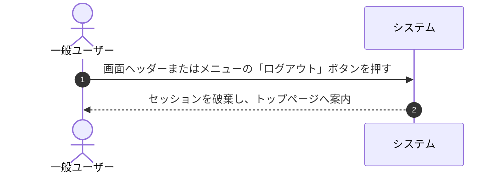

# ユースケース: ユーザーがログアウトする

## 1. 概要 (Overview)
一般ユーザーが画面ヘッダー等からログインセッションを終了（ログアウト）し、未ログイン状態に戻ってトップページ（`/`）へ遷移するプロセスを定義します。

## 2. アクター (Actors)
* **一般ユーザー (User)**: システムにログイン中の一般アクター。

## 3. 事前条件 (Preconditions)
* 一般ユーザーが自身のアカウントでシステムにログインしていること。

## 4. 事後条件 (Postconditions)
* ユーザーのログインセッションが破棄され、保護された画面（`/dashboard`, `/settings` 等）へのアクセス権限が解除される。
* トップページ（`/`）へ遷移する。

## 5. 基本フロー (Main Success Scenario)

1. **[一般ユーザー]** 画面ヘッダーまたはメニュー内の「ログアウト」ボタンを押します。
2. **[システム]** ログインセッションを破棄し、トップページ（`/`）へ遷移します。

## 6. 代替・例外フロー (Alternative & Exception Flows)

### 6.1. 既にセッションが切れていた場合
* **6.1.1** セッション有効期限切れ等の場合でも、システムは安全に未ログイン状態としてトップページへ案内します。

## 7. 関連画面
* **一般ユーザー用**: ログイン後画面全般 (`/dashboard`, `/settings` 等)、トップページ (`/`)
