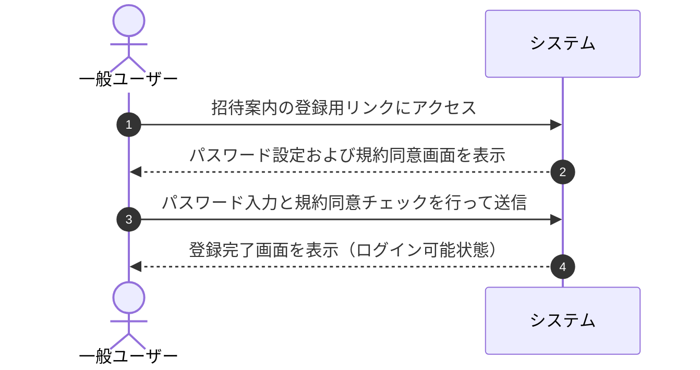

# ユースケース: ユーザーが招待メールから登録する

## 1. 概要 (Overview)
招待案内（招待メール）を受け取った一般ユーザーが、専用の登録用リンクからパスワード設定および利用規約・プライバシーポリシーへの同意を行い、アカウントを開設してログイン可能な状態にするプロセスを定義します。

## 2. アクター (Actors)
* **一般ユーザー (User)**: 招待を受けてシステムアカウントを開設・利用するアクター。

## 3. 事前条件 (Preconditions)
* ユーザーが有効な招待案内（登録用リンク）を受信していること。
* システムの「招待機能」が有効（ON）に設定されていること。

## 4. 事後条件 (Postconditions)
* 利用規約およびプライバシーポリシーへの同意履歴とともに、ユーザーのアカウントが正常に開設される。
* 招待ステータスが使用済みに更新され、システムにログインできる状態になる。

## 5. 基本フロー (Main Success Scenario)

1. **[一般ユーザー]** 届いた招待案内メール内の登録用リンクをクリックしてアクセスします。
2. **[システム]** アクセスされたリンクの有効性を確認し、パスワード設定および規約同意画面を表示します。
3. **[一般ユーザー]** 8文字以上のパスワードを入力し、利用規約およびプライバシーポリシーの同意チェックボックスをオンにして「登録する」ボタンを押します。
4. **[システム]** 入力内容（パスワード文字数、規約同意の有無）を確認します。
5. **[システム]** アカウントの開設処理を完了し、登録完了メッセージおよびログイン画面への導線を表示します。

## 6. 代替・例外フロー (Alternative & Exception Flows)

### 6.1. 招待リンクが無効・期限切れの場合
* **6.1.1** アクセスされた招待リンクが有効期限切れ、または取り消し済み・使用済みの場合、システムは「招待リンクが無効または期限切れです」というエラー画面を表示します。
* **6.1.2** ユーザーは管理者に連絡し、再招待を依頼します。

### 6.2. 招待機能自体が無効（OFF）に設定されている場合
* **6.2.1** システムの「招待機能」が無効化されている場合、システムは「招待機能は現在利用できません」と案内画面を表示します。

### 6.3. 規約への同意がされていない場合
* **6.3.1** 利用規約およびプライバシーポリシーへの同意チェックがされていない場合、システムは「利用規約およびプライバシーポリシーに同意してください」とエラーメッセージを表示し、登録を中断します。
* **6.3.2** ユーザーは規約を確認してチェックを入れ、再送信します。

### 6.4. パスワードが要件を満たさない場合
* **6.4.1** パスワードが8文字未満の場合、システムは「パスワードは8文字以上で入力してください」とエラーメッセージを表示します。
* **6.4.2** ユーザーは8文字以上のパスワードを入力し直します。

## 7. 関連画面
* **ユーザー用**: 招待登録画面 (`/register?token=...`)

## 8. UI/UX・フォーム仕様の考慮事項
* **パスワード自動補完・生成への対応**:
  * ブラウザやパスワードマネージャー（Safari, Chrome等）の強力なパスワード自動生成機能を妨げないよう、適切なフォーム属性（`autocomplete="new-password"`）を設定し、確認用入力欄への同時補完をサポートする。
