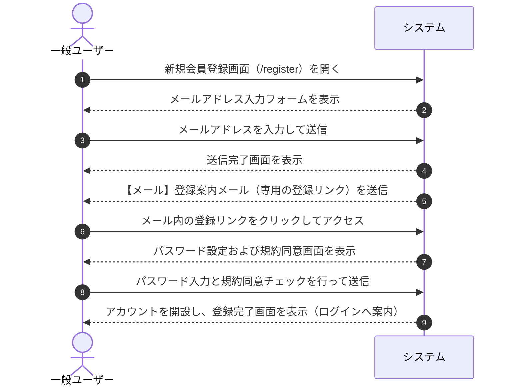

# ユースケース: ユーザーが新規会員登録する

## 1. 概要 (Overview)
一般ユーザー（ビジター）がメールアドレスを入力して登録確認メールを受け取り、メール記載の専用リンクからパスワード設定および利用規約・プライバシーポリシーへの同意を行って、アカウントを開設するプロセスを定義します。

## 2. アクター (Actors)
* **一般ユーザー (User)**: システムのアカウント開設を希望する未登録のビジター。

## 3. 事前条件 (Preconditions)
* ユーザーがシステムにアクセス可能であること。
* 登録に使用する有効なメールアドレスを所持し、メールを受信できること。
* システムの「自由登録制」が有効（ON）に設定されていること（デフォルト: 有効）。

## 4. 事後条件 (Postconditions)
* メールアドレスの所有確認が完了し、利用規約およびプライバシーポリシーへの同意履歴とともにアカウントが開設される。
* 開設されたアカウントでシステムにログインできる状態になる。

## 5. 基本フロー (Main Success Scenario)

1. **[一般ユーザー]** トップ画面またはログイン画面から「新規登録」リンクを押し、会員登録画面を開きます。
2. **[システム]** メールアドレス入力フォームを表示します。
3. **[一般ユーザー]** 登録したいメールアドレスを入力し、「確認メールを送信」ボタンを押します。
4. **[システム]** 入力されたメールアドレスが有効な形式かつ未登録であることを確認し、登録案内メール（専用の登録リンク）を送信して、画面に「確認メールを送信しました」と案内を表示します。
5. **[一般ユーザー]** 受信した登録案内メール内の登録用リンクをクリックしてアクセスします。
6. **[システム]** リンクの有効性を確認し、パスワード設定および利用規約・プライバシーポリシー同意フォームを表示します。
7. **[一般ユーザー]** 8文字以上のパスワードおよび確認用パスワードを入力し、利用規約・プライバシーポリシーへの同意チェックを入れて「登録を完了する」ボタンを押します。
8. **[システム]** 入力内容を確認し、アカウントの開設処理を完了して登録完了メッセージを表示します。

## 6. 代替・例外フロー (Alternative & Exception Flows)

### 6.1. メールアドレスが既に登録済みの場合
* **6.1.1** 入力されたメールアドレスが既に既存のアカウントとして登録されている場合、システムはセキュリティ上の理由（登録有無の推測防止）を考慮し、画面上では通常通り送信完了を表示しつつ、実際には案内メールの送付を行わない、または「既に登録済みのアカウントです」と案内するメールを送信します。

### 6.2. 登録リンクが無効・期限切れの場合
* **6.2.1** メール内の登録リンクが有効期限切れ、または既に使用済みの場合は、「登録リンクが無効または期限切れです。最初からやり直してください」と案内画面を表示します。
* **6.2.2** ユーザーは再度メールアドレス入力から登録をやり直します。

### 6.3. 利用規約・プライバシーポリシーに同意していない場合
* **6.3.1** 規約同意チェックボックスがオンになっていない場合、システムは「利用規約およびプライバシーポリシーへの同意が必要です」とエラーメッセージを表示し、登録を中断します。
* **6.3.2** ユーザーは規約を確認してチェックを入れ、再送信します。

### 6.4. パスワードが要件を満たさない場合（8文字未満など）
* **6.4.1** パスワードが8文字未満の場合、システムは「パスワードは8文字以上で入力してください」とエラーメッセージを表示します。
* **6.4.2** ユーザーは8文字以上のパスワードを入力し直します。

### 6.5. パスワードと確認用が一致しない場合
* **6.5.1** パスワードと確認用パスワードが一致しない場合、システムは「パスワードが確認用と一致しません」とエラーメッセージを表示します。
* **6.5.2** ユーザーは確認用パスワードを正しく入力し直します。

### 6.6. 自由登録機能が無効（OFF）に設定されている場合
* **6.6.1** システムの「自由登録制」が無効に設定されている場合、登録画面（`/register`）へのアクセス時に「現在、一般の新規受付は停止しております（招待制のみ）」と案内画面を表示するか、ログイン画面へ安全にリダイレクトします。

## 7. 関連画面
* **一般ユーザー用**: 会員登録（メール入力）画面 (`/register`)、登録完了画面 (`/register/sent`)、本登録（パスワード設定・規約同意）画面 (`/register?token=...`)、ログイン画面 (`/login`)

## 8. UI/UX・フォーム仕様の考慮事項
* **パスワード自動補完・生成への対応**:
  * ブラウザやパスワードマネージャー（Safari, Chrome等）の強力なパスワード自動生成機能を妨げないよう、適切なフォーム属性（`autocomplete="new-password"`）を設定し、確認用入力欄への同時補完をサポートする。
